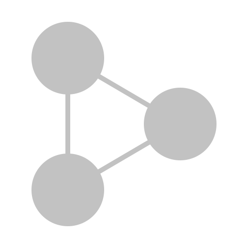

<!-- PROJECT LOGO -->
 

  

  <h3 align="center">Solipr</h3>
  

     
    A purely Rust-based Version Control System.
  

---

## Introduction
Solipr is a purely Rust-based Version Control System.

## How does it work?

In order to fully understand how Solipr works, you need to read step by step the documentation : 

| **Documentation** | **Short Description** |
|-------------------|-----------------------|
| [SVG](docs/svg.md) | A **data structure** that manages concurrent modifications to a single value using a [directed acyclic graph (DAG)](https://en.wikipedia.org/wiki/Directed_acyclic_graph) to **handle conflicts**. |
| [OVG](docs/ovg.md) | A [directed acyclic graph (DAG)](https://en.wikipedia.org/wiki/Directed_acyclic_graph) that manages **multiple ordered values** and resolves conflicts through designated "First" and "Last" nodes. |

## Our team

**founders**

- [Tipragot](https://tipragot.fr)
- [CoCoSol](https://cocosol.fr)
