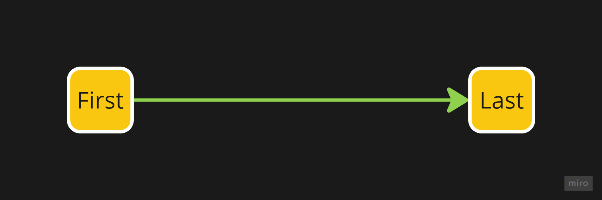
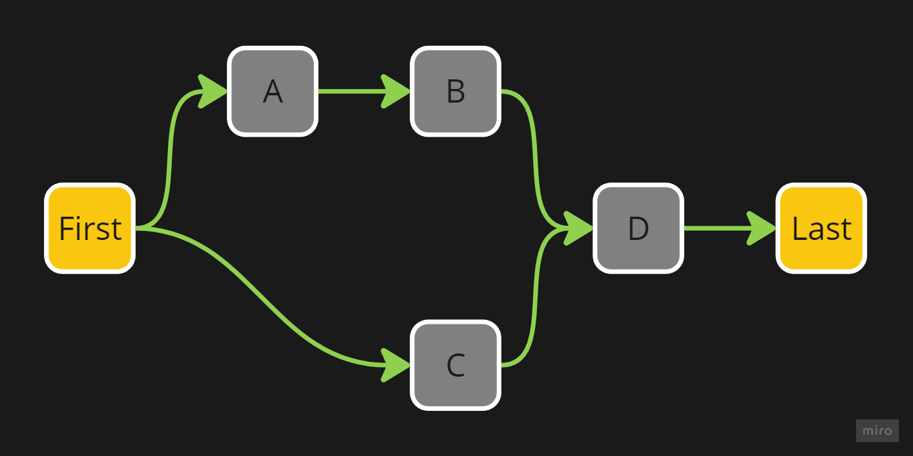
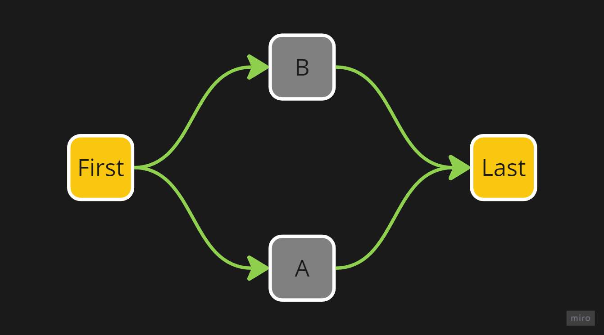
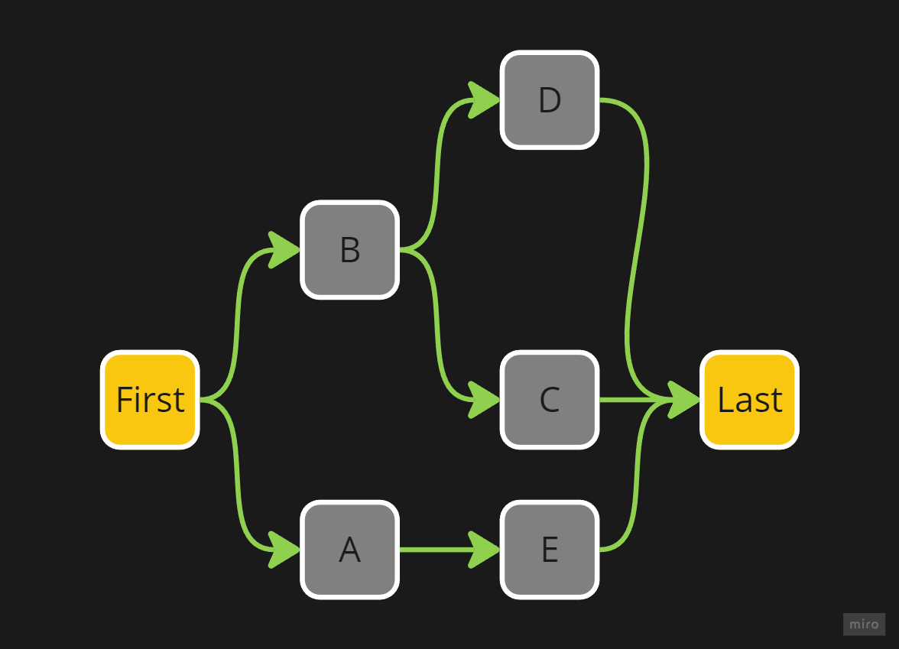
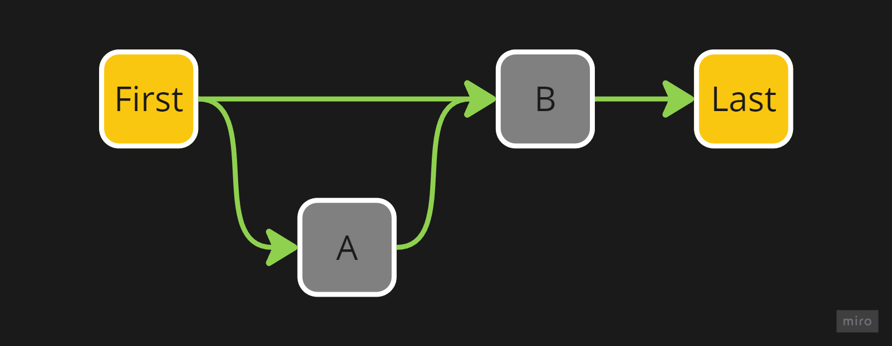
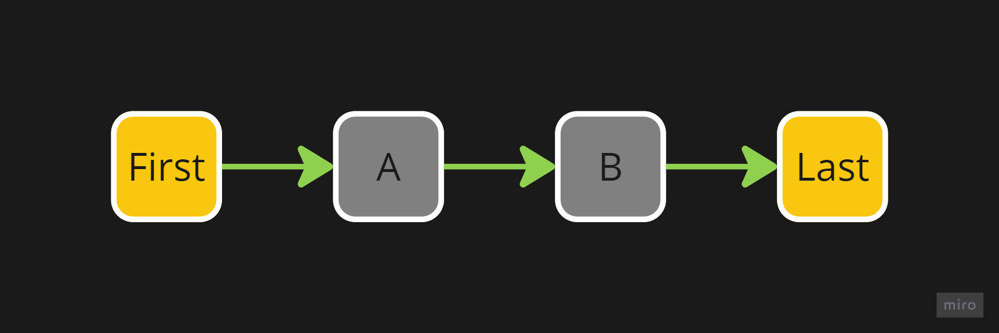
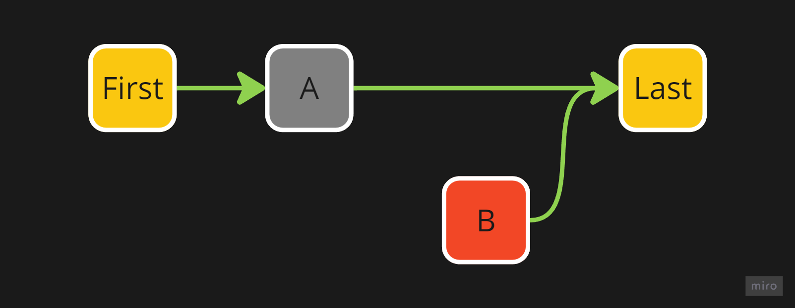
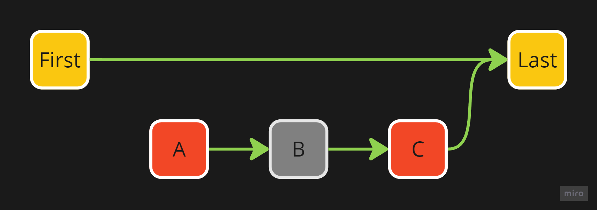
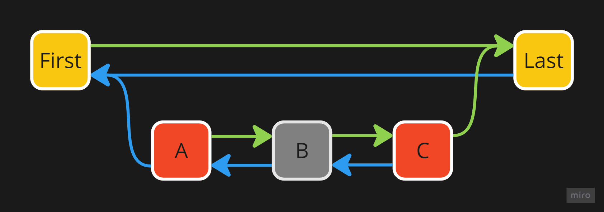
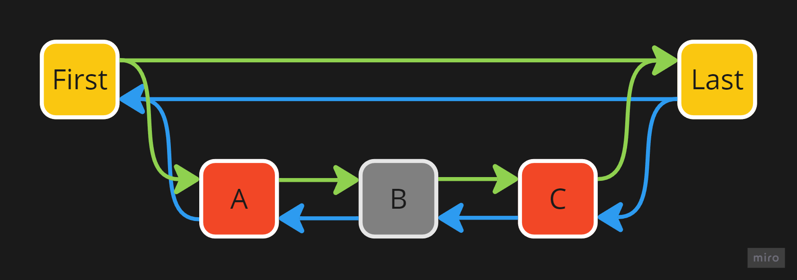

# Ordered Value Graph

[SVGs](svg.md) are useful for handling a single value, but the problem is that they don't allow handling multiple ordered values.

For this reason, we created a new data structure that we called the Ordered Value Graph (OVG).

This data structure is a [DAG](https://en.wikipedia.org/wiki/Directed_acyclic_graph) where each node corresponds to a value.

Each node contains four pieces of information, here are the first two:
- The value contained in the node (represented by the text inside the node in the examples)
- A link to the next node (also called the child of the node, represented by the green arrows going from the node to the next node in the examples)

We will discuss the other two pieces of information in the section on [deletion](#deletion).

In an OVG, there are always two nodes: the `First` and the `Last`, which are present to indicate where the OVG starts and where it ends when traversing it.

Here are some examples of valid OVGs:

## Conflicts

The link to the the child node is stored using an [SVG](svg.md), which, as we will see, allows managing conflicts and their resolution.

A conflict in an OVG is represented by multiple possible paths to traverse from `First` to `Last`.

For example, here are some OVGs with conflicts:

An "empty" path is also considered a conflict. As soon as a link splits (the link's underlying [SVG](svg.md) contains more than one current value), we consider there to be a conflict.

For example, in the case below, we consider there to be a conflict regarding the existence of `A`:

Conflict resolution is fairly simple: you just need to modify the links (using the [`Replace`](svg.md#operations) operation of the underlying [SVG](svg.md)) so that the conflict no longer exists.

For example, the previous conflict can be resolved by replacing the child link of `First` with a link to `A`:

As a note, for security reasons, direct modification of the underlying [SVG](svg.md) is usually not allowed. We will discuss in the section on [modification operations](#operations) how the graph can be modified.

## Deletion

When we want to delete a node, we cannot simply remove it from the graph because another user, unaware of the deletion, might potentially add links to this node before syncing.

Therefore, instead of deleting the node, we store an additional value in each node to indicate whether it has been deleted or not. We call this value the node's existence (we represent deleted nodes by coloring them in red in the examples).

For example, let's consider this OVG:

If we want to delete node `B`, we must mark it as deleted and then change the child link of `A` so that it points to `Last`:

Unfortunately, this method does not work perfectly. Look at this OVG:

Imagine we decide to delete both `A` and `C`, but at the same time, another user decides to add a node `B` between `A` and `C`. After merging the two changes, we get this OVG:

We end up with a graph with no conflicts, but adding a node in the middle of several deleted elements should result in a conflict.

To resolve this issue, we need to store the link to the previous node (also called the parent of the node, represented by the red arrows in the examples) in each node in addition to the link to the next node.

If we do this in our previous example, we get:

Now, we can tell if a conflict is present or not. To do this, we must start from all the nodes that are not deleted and traverse the graph to reconstruct all the missing links:

Now, if we traverse the graph starting from `First`, we clearly see the conflict.

## Operations

### Insert
TODO

### Delete
TODO
