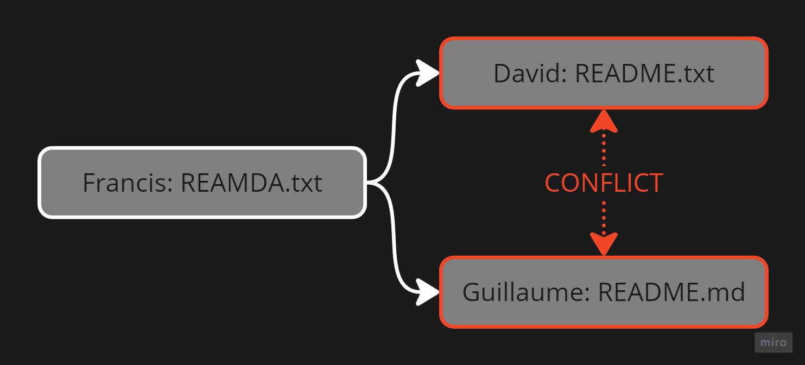
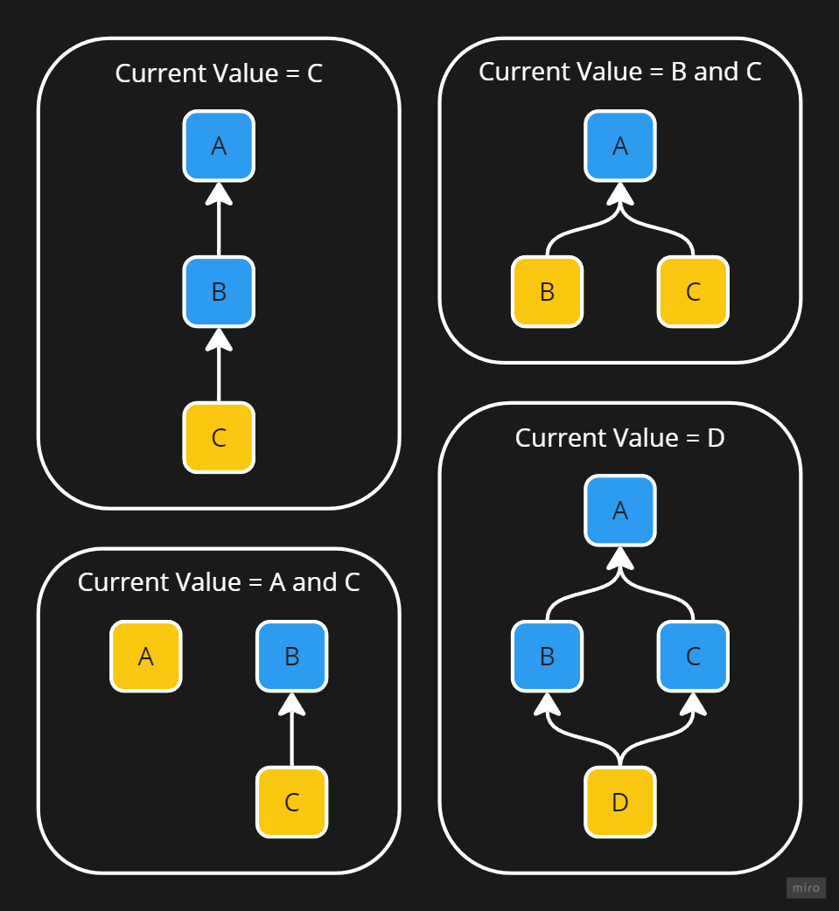
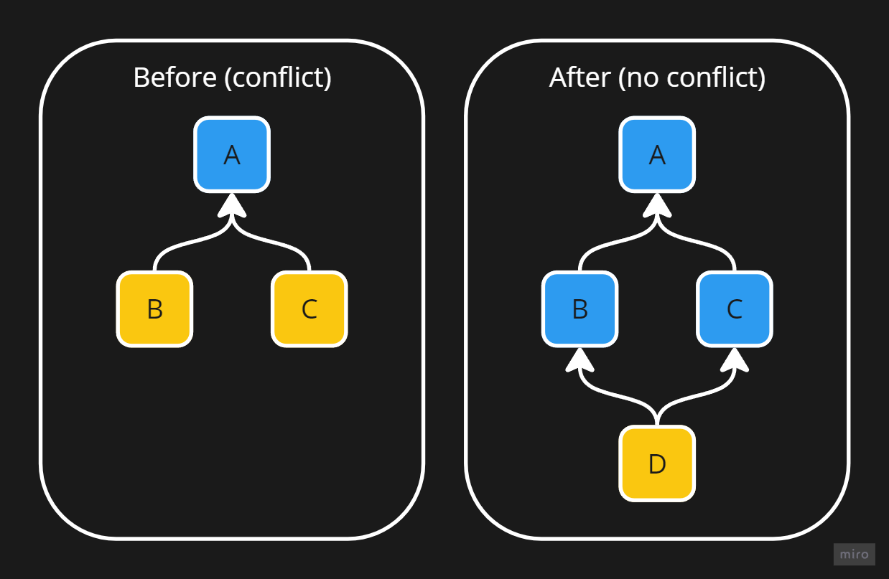
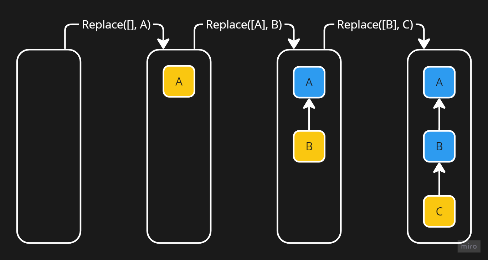
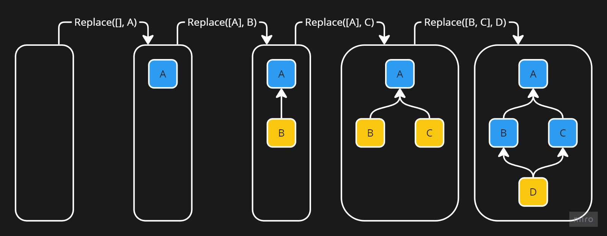

# Single Value Graph

A **Single Value Graph** (SVG) is a data structure used to store a single value and enable you to **manage conflicts**. It is the main data structure used in **Solipr**.

For example, if you want to store the name of a file so that multiple people can modify it in parallel and manage conflicts correctly, you would use an SVG:

- Francis names the file "READMA.txt"
- David sees the error and corrects the file name to "README.txt"

Here, there is no conflict. But if at the same time:
- Guillaume decides to change the file name to "README.md"

There will be a conflict between him (README.md) and David (README.txt) because they both modified the file "READMA.txt".

Example Illustration:

## Storage

SVGs are stored in the form of a [DAG](https://en.wikipedia.org/wiki/Directed_acyclic_graph) where the current value is represented by nodes not pointed to by any other node (represented with a yellow color in the examples). Throughout this documentation, we will call these nodes the heads.

Here are examples of SVGs and their current values:

## Conflicts

An SVG is considered to represent a conflict if it contains more than one head. For example, in the previous example, the second and fourth SVGs are considered to represent a conflict.

Resolving a conflict is very simple, just add a new node pointing to each head of the conflict:

## Operations

There is only one possible operation in an SVG: `Replace`, this operation consists of replacing one or more nodes with a new one. This operation simply adds a new node in the SVG pointing to the nodes to be replaced.

Multiple operations on a SVG step by step (without conflicts):

Multiple operations on a SVG step by step (with conflict and resolution):

## Apply Order

Applying the same operations in a different order always leads to the same state, making our SVG a [CRDT](https://en.wikipedia.org/wiki/Conflict-free_replicated_data_type).
